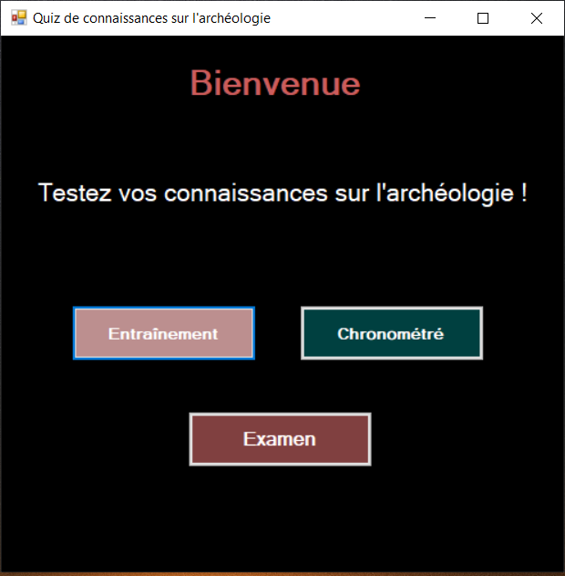
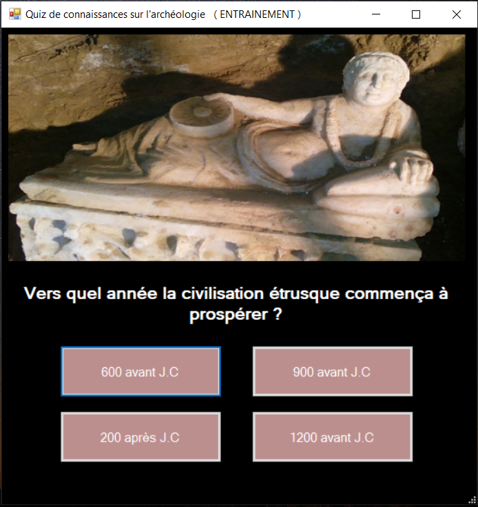
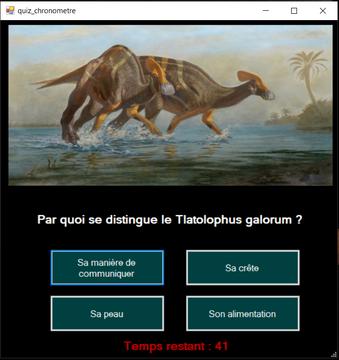
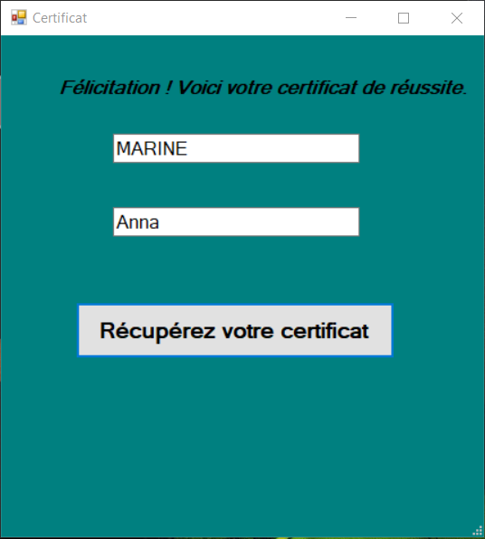

#Quiz de connaissances sur l'archéologie

Ce projet a été réalisé à l'aide du langage de programmation C# et de Windows Form .Net Framework.
Il est relié à une base de données MongoDB appelé quiz_archeo.

##Utilisaion du projet

Pour lancer correctement le projet, vous devez préalablement l'ouvrir en sélectionnant la solution et non le dossier.

Vous devez ensuite installez le package MongoDB.Driver

###Création de la base de données
Vous pouvez utiliser soit le fichier quiz_archeo.xlsx, soit qui_archeo.js pour créer votre bdd.

### Lancement du projet
Vous pouvez désormais lancer l'application.

## Composition du projet

Ce quiz permet de tester les connaissances de l'utilisateur sur différents sujets archéologiques tels que les vikings, les dinosaures, les civilisations passées et bien d'autres !

###Page d'accueil du jeu

Vous avez différents modes de quiz.

####Mode entraînement

Ce mode permet de tester ses connaissances tout en apprenant.

Après chaque réponse choisie par l'utilisateur, une explication est donnée sur le sujet de la question. 
Ce qui permet à ce dernier d'en apprendre d'avantage tout au long du quiz.

### Mode chronométré

Ce mode est un entrainement au mode examen.
L'utilisateur  à 45 secondes pour répondre à 10 questions.
Si le temps sécoule avant d'avoir répondu à toutes les questions, l'utilisateur à perdu et le quiz se ferme.

### Mode examen

Ce mode permet de tester les connaissances de l'utilisateurs en un temps limité (15 questions en 1 min)

A la fin de ce quiz, l'utilisateur se voit attribué son certificat de réussite lorsqu'il obtient une note égal ou supérieur à la moyenne.

Afin de l'obtenir, un formulaire s'ouvre. L'utilisateur doit entrer son nom et prénom puis récupérer son certificat.

Voici un exemple (QuizGame/QuizGame/bin/Debug/Certificat_MARINE_Anna.pdf)

